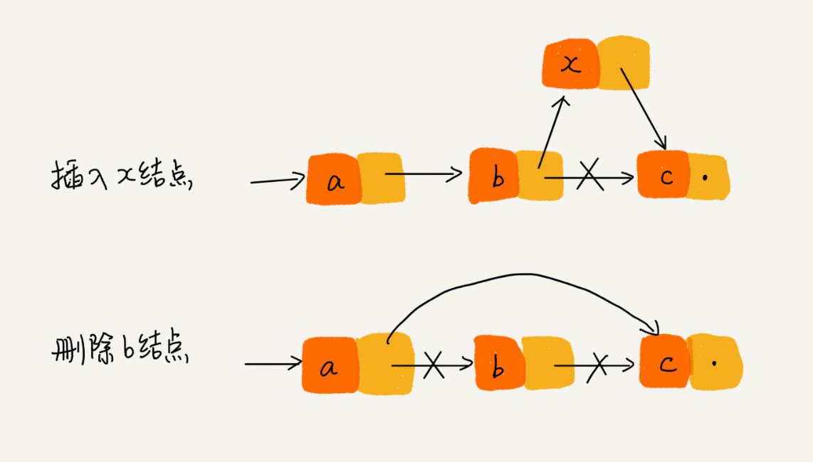

---             
title:  06 | 链表（上）：如何实现LRU缓存淘汰算法?
date:   2019-05-01 12:00:00
---

今天我们来聊聊“链表（Linked list）”这个数据结构。

缓存是一种提高数据读取性能的技术，在硬件设计、软件开发中都有着非常广泛的应用，比如常见的 CPU 缓存、数据库缓存、浏览器缓存等等。

缓存的大小有限，当缓存被用满时，哪些数据应该被清理出去，哪些数据应该被保留？这就需要缓存淘汰策略来决定。常见的策略有三种：先进先出策略 FIFO（First In，First Out）、最少使用策略 LFU（Least Frequently Used）、最近最少使用策略 LRU（Least Recently Used）。

### 五花八门的链表结构
相比数组，链表是一种稍微复杂一点的数据结构。为了直观地对比，我画了一张图。从图中我们看到，数组需要一块`连续的内存空间`来存储，对内存的要求比较高。如果我们申请一个 100MB 大小的数组，当内存中没有连续的、足够大的存储空间时，即便内存的剩余总可用空间大于 100MB，仍然会申请失败。

而链表恰恰相反，它并不需要一块连续的内存空间，它通过“指针”将一组`零散的内存块`串联起来使用，所以如果我们申请的是 100MB 大小的链表，根本不会有问题。

三种最常见的链表结构：单链表、双向链表和循环链表。

单链表：
我们刚刚讲到，链表通过指针将一组零散的内存块串联在一起。其中，我们把内存块称为链表的“`结点`”。为了将所有的结点串起来，每个链表的结点除了存储数据之外，还需要记录链上的下一个结点的地址。如图所示，我们把这个记录下个结点地址的指针叫作`后继指针 next`。

其中有两个结点是比较特殊的，它们分别是第一个结点和最后一个结点。我们习惯性地把第一个结点叫作`头结点`，把最后一个结点叫作`尾结点`。其中，头结点用来记录链表的基地址。有了它，我们就可以遍历得到整条链表。而尾结点特殊的地方是：指针不是指向下一个结点，而是指向一个`空地址 NULL`，表示这是链表上最后一个结点。

在链表中插入或者删除一个数据，我们并不需要为了保持内存的连续性而搬移结点，因为链表的存储空间本身就不是连续的。

针对链表的插入和删除操作，我们只需要考虑相邻结点的指针改变，所以对应的时间复杂度是 O(1)。

但是，有利就有弊。链表要想随机访问第 k 个元素，就没有数组那么高效了。因为链表中的数据并非连续存储的，所以无法像数组那样，根据首地址和下标，通过寻址公式就能直接计算出对应的内存地址，而是需要根据指针一个结点一个结点地依次遍历，直到找到相应的结点。

链表随机访问的性能没有数组好，需要 O(n) 的时间复杂度。

循环链表：

双向链表：

